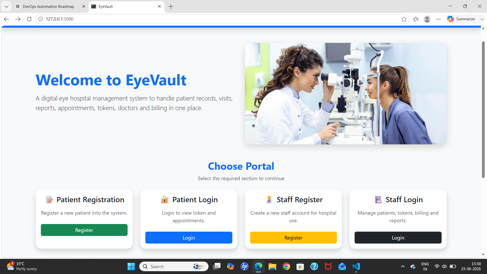
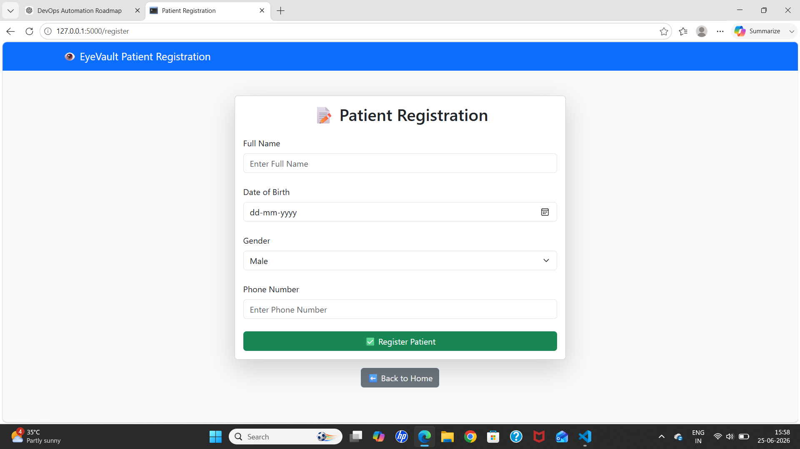
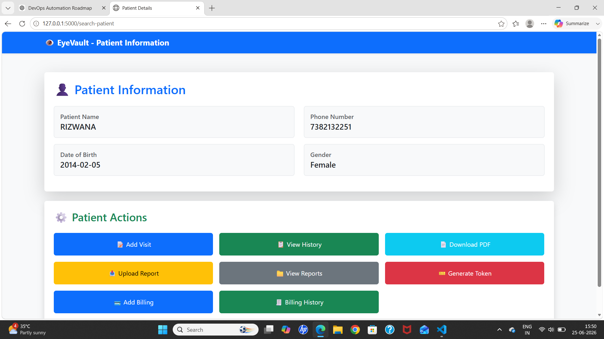
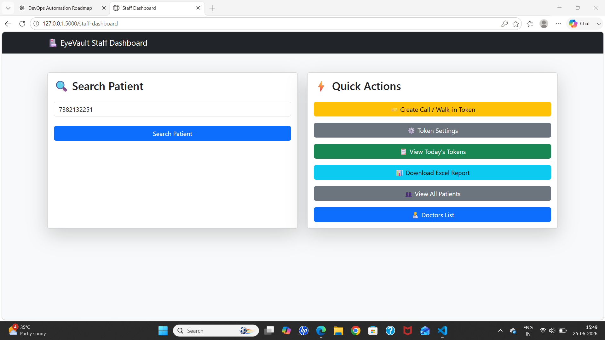
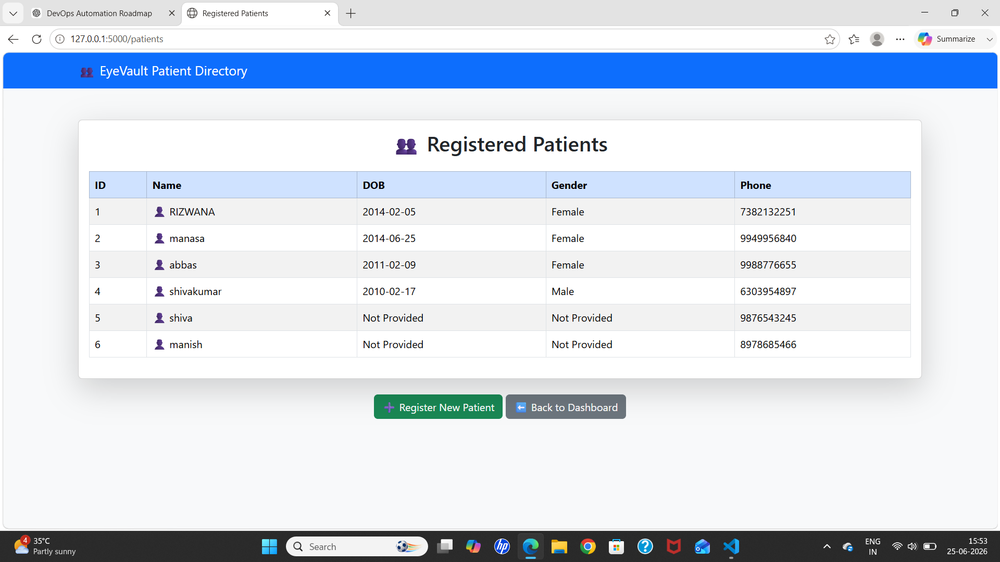
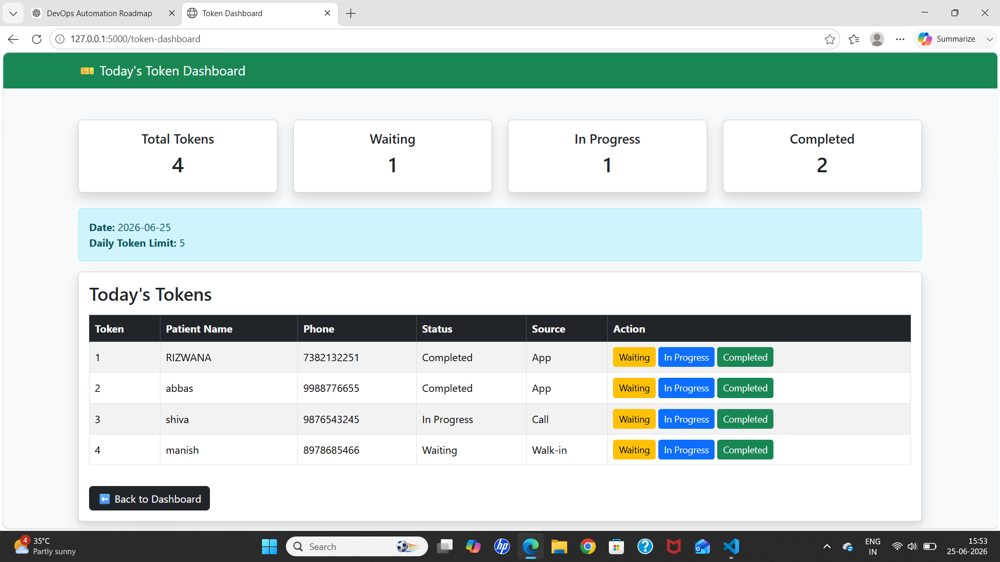

# EyeVault

EyeVault is a Flask-based Hospital / Eye Clinic Management System built to manage patients, staff, visits, reports, billing, tokens, doctors, and spectacles in one place.

It helps clinic staff handle daily operations like patient registration, visit history, report uploads, token generation, billing management, and patient dashboard access.

---

## Built With

- Python
- Flask
- Flask-SQLAlchemy
- SQLite
- Bootstrap 5
- Jinja2
- OpenPyXL
- ReportLab

---

## Features

- Patient Registration and Patient Login
- Staff Registration and Staff Login
- Patient Dashboard with:
  - Personal details
  - Token status
  - Visit history
  - Uploaded reports
  - Billing history
- Staff Dashboard for clinic operations
- Add and manage patient visits
- Upload and view patient reports
- Generate patient tokens
- Manual token generation by staff
- Token dashboard with live token status
- Token limit settings
- Add and manage doctors
- Add and manage spectacles
- Add billing for patients
- Edit billing records
- View complete billing history
- Export token records to Excel
- Download patient visit history as PDF

---

## Project Modules

### 1. Patient Module
- Patient registration
- Patient login using phone number
- Patient dashboard
- View token details
- View reports
- View visit history
- View billing history

---

### 2. Staff Module
- Staff registration
- Staff login
- Search patient by phone
- Open patient information page
- Add visit details
- Upload reports
- Generate token
- Add billing
- Edit billing
- View billing history

---

### 3. Token Management
- Generate token from patient dashboard
- Manual token generation from staff dashboard
- Token dashboard to track:
  - Waiting tokens
  - In Progress tokens
  - Completed tokens
- Token limit settings per day
- Export token details to Excel

---

### 4. Billing Management
- Add bill for a patient
- Edit bill later if payment is pending
- Track:
  - Consultation fee
  - Medicine fee
  - Spectacles name
  - Spectacles cost
  - Total amount
  - Paid amount
  - Due amount
  - Payment status (Due / Completed)
- Billing history visible in both:
  - Staff side
  - Patient dashboard

---

### 5. Reports and History
- Upload patient reports
- View all uploaded reports
- Add patient visit details
- View visit history
- Download visit history as PDF

---

## Screenshots

### Home Page


---

### Patient Registration


---

### Patient Information


---

### Staff Dashboard


---

### Registerd Patients


---

### Token Dashboard


---

⚙️ Installation
## 1. Clone the repository

```bash
git clone https://github.com/Rizwana200/EyeVault.git
cd EyeVault

## 2. Create virtual environment

```bash
python -m venv venv

```
## 3. Activate virtual environment

### 🪟 Windows

```bash
venv\Scripts\activate

```
### 🍎 Mac / Linux

```bash
source venv/bin/activate

```
## 4. Install dependencies

```bash
pip install -r requirements.txt

```
## 5. Run the project

```bash
python app.py

```

## 🌐 Open in browser

Open your browser and visit:
http://127.0.0.1:5000/
